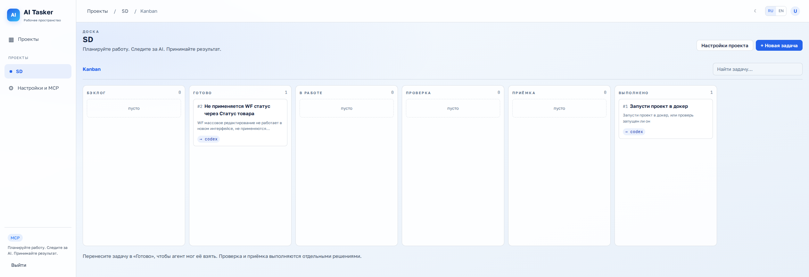
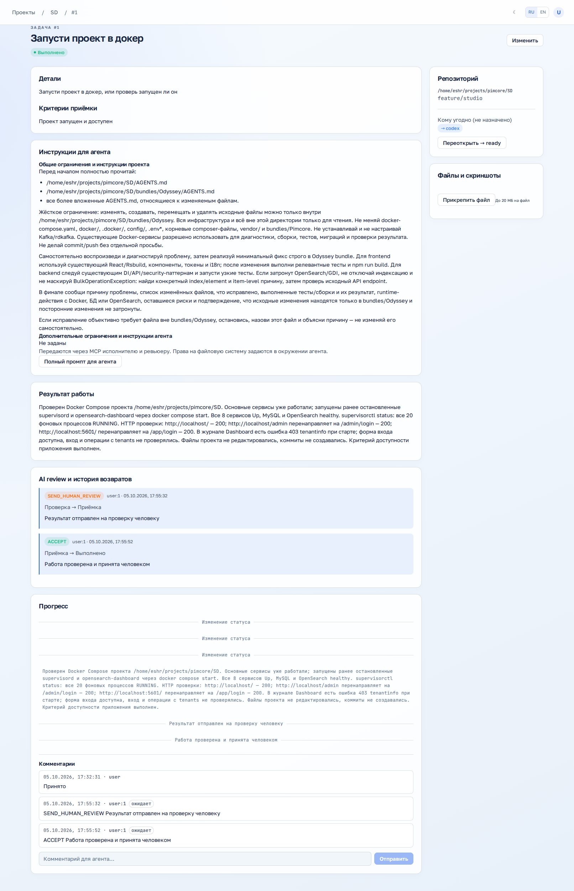
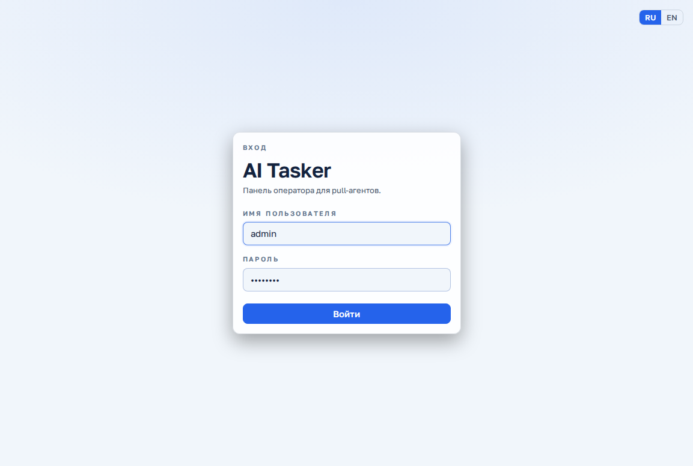

# AI Tasker

Минимальная рабочая система задач на основе [Agent Kanban](https://github.com/graywrk/agent-kanban):

**Проект → Бэклог → Готово → В работе → Проверка → Приёмка → Выполнено.**

AI Tasker — пассивная доска и MCP-сервер. Ваш Codex из VS Code подключается к доске и работает непосредственно в указанном репозитории. Приложение не запускает Codex, не вызывает OpenAI API и не требует `OPENAI_API_KEY`.

## Быстрый запуск через Docker

Нужен только Docker Desktop или Docker Engine с Compose v2+. Python, Node и PostgreSQL на компьютере устанавливать не нужно.

```bash
git clone https://github.com/remzone/ai-tasker.git
cd ai-tasker
sh scripts/start-docker.sh
```

Откройте **http://localhost:7331** и создайте администратора (пароль от 8 символов). Затем создайте проект, укажите абсолютный путь к репозиторию **на компьютере агента** и основную ветку. Создайте задачу и переведите её в **Готово**, чтобы агент мог забрать её через MCP.

Скрипт один раз создаёт `.env.docker` со случайным `SESSION_SECRET`, собирает frontend/backend, запускает PostgreSQL, применяет миграции и ожидает готовности приложения. `.env.docker` не попадает в git; сохраняйте его вместе с резервной копией данных. Существующий `.env` для разработки не изменяется.

На Windows запускайте скрипт в Git Bash / WSL либо используйте ручной вариант в PowerShell:

```powershell
Copy-Item .env.docker.example .env.docker
# Скопируйте результат следующей команды в SESSION_SECRET файла .env.docker:
docker run --rm python:3.11-slim python -c "import secrets; print(secrets.token_urlsafe(48))"
docker compose --env-file .env.docker up -d --build --wait
```

```bash
docker compose --env-file .env.docker logs -f app   # логи приложения
docker compose --env-file .env.docker down          # остановка, данные сохраняются
sh scripts/start-docker.sh                          # запуск / обновление после git pull
```

Задачи и пользователи хранятся в volume `ak_pgdata`, вложения — в `ak_artifacts` (Compose добавляет префикс проекта). `down --volumes` удаляет эти данные. Приложение доступно только на localhost; PostgreSQL не публикует порт на хосте. Если порт занят, поменяйте `HOST_PORT` в `.env.docker`; используйте тот же порт в браузере и MCP URL. Для внешнего доступа настройте HTTPS reverse proxy и `PUBLIC_URL`.

Агент работает с файлами на своей машине. Чтобы **сервер в Docker** также мог собирать git diff и читать локальные артефакты, примонтируйте репозиторий по тому же абсолютному пути, что указан в проекте. Например, создайте `docker-compose.repositories.yml`:

```yaml
services:
  app:
    volumes:
      - /absolute/path/to/repository:/absolute/path/to/repository:ro
```

После первого запуска:

```bash
docker compose --env-file .env.docker -f docker-compose.yml -f docker-compose.repositories.yml up -d --wait
```

Повторяйте эту команду при обновлении контейнера с дополнительными mounts. На Windows/WSL путь внутри контейнера должен быть Linux-путём; у агента должен быть доступ к соответствующему рабочему репозиторию. Без mounts задачи, MCP, загрузка файлов через HTTP и ручная приёмка работают, но серверный git diff недоступен.

## Скриншоты AI Tasker

Текущий интерфейс форка: светлая тема, русский язык, проект SD.







## Основные отличия от Agent Kanban

Основа — [graywrk/agent-kanban](https://github.com/graywrk/agent-kanban), исходный commit `a59b346`. История Git и MIT-лицензия оригинала сохранены.

- Новый интерфейс AI Tasker: список проектов, навигация, светлая/тёмная темы и адаптивная доска; русский и английский языки.
- Шесть этапов: **Бэклог → Готово → В работе → Проверка → Приёмка → Выполнено**. Отдельные AI review и человеческая приёмка, возврат на доработку с обязательным комментарием и история решений.
- Атомарный захват работы и ревью; назначение конкретного reviewer, защита от конкурентных решений и обхода человеческой приёмки через агентский токен.
- Настройки инструкций проекта и задачи, шаблоны и полный промпт для агента в интерфейсе и MCP-контексте.
- Вставка скриншотов в описание через буфер обмена и загрузка вложений.
- Повторный показ MCP-токенов администратору, зашифрованное хранение, замена токена, проверка подключения и копирование конфигурации клиента.
- Docker-запуск одной командой со случайным session secret, миграциями, проверкой готовности и сохранением данных.

Приложение сохраняет pull-модель оригинала: агенты сами забирают задания через MCP.

## Подключить Codex из VS Code

1. В AI Tasker откройте **Настройки и MCP**, создайте токен с agent_name `codex`. Для отдельного reviewer можно создать `codex-reviewer`.
2. В строке агента нажмите **Показать / копировать**, затем **Проверить MCP**. Проверка выполняет реальные `list_projects` и `list_tasks` с этим токеном, без браузерной session cookie.
3. Нажмите **Копировать конфиг Codex** и замените существующий блок `mcp_servers.tasker` в конфиге используемого Codex. Копируемый блок уже содержит URL и действующий Authorization:

```toml
[mcp_servers.tasker]
url = "http://localhost:7331/mcp"

[mcp_servers.tasker.http_headers]
Authorization = "Bearer ВАШ_ТОКЕН_АГЕНТА"
```

4. В форме MCP можно оставить `Bearer token env var` пустым и вставить **Копировать Authorization** в Headers → Authorization. Сохраните, перезапустите расширение и откройте новый чат.

Токен можно повторно показать после обновления страницы. Новые токены хранятся зашифрованными с ключом, полученным из `SESSION_SECRET`; секреты не возвращаются в общем списке токенов. Расшифровка и замена доступны только администратору с браузерной сессией. Стабильный `SESSION_SECRET` нужен для повторного показа; после его смены токены продолжат авторизовываться по хешу, а для повторного показа потребуется **Заменить**. Старые токены, сохранённые только как хеши, нельзя восстановить: **Сгенерировать токен** заменяет значение, сохраняя имя агента и описание. Замена немедленно отключает старый токен; обновите конфиги его клиентов.

`SESSION_SECRET` не является MCP-токеном. При желании можно использовать `bearer_token_env_var = "AI_TASKER_MCP_TOKEN"` вместо `http_headers`: задайте переменную именно в окружении процесса Codex до его запуска. Секреты не добавляйте в git.

Параметры Streamable HTTP и конфигурация CLI/IDE сверены с [официальной документацией Codex MCP](https://learn.chatgpt.com/docs/extend/mcp?surface=cli).

В поле **Описание** при создании или редактировании задачи можно вставить скриншот через **Ctrl+V** (⌘V на Mac). Изображение появится в предпросмотре и загрузится как вложение при сохранении; оно остаётся в тексте задачи после перезагрузки.

## Работа агента

Попросите Codex: «Возьми доступную задачу из AI Tasker через MCP и выполни её».

- `list_projects`, `get_next_task` / `list_tasks` — обнаружение работы.
- `claim_task(task_id, agent="codex")` — атомарный claim. Два агента не могут взять одну задачу.
- `get_task_context(task_id)` — описание, criteria, repository path, comments, attachments, summary и вся история работы/решений.
- Прочитайте AGENTS.md и skills **в указанном repository**. Создание ветки, изменение файлов, commits и tests выполняйте собственными инструментами Codex в repository.
- `post_progress` / `post_comment` / `post_artifact` — сообщайте progress и результаты. `get_comments` — читайте обратную связь.
- `set_task_branch` / `set_task_pr` — сохраните ветку/PR, если они есть.
- `request_review(task_id, agent="codex", summary="Что сделано; commits/files/tests")` — передайте работу на AI review. Summary обязателен; diff собирается существующим git механизмом, если доступны repo/base/branch.
- Старый `complete_task` теперь также отправляет на **Проверку**, чтобы не обходить AI review и человеческую приёмку.

## AI review и приёмка

В карточке результата доступны **Отправить на ревью агенту**, **Отправить на проверку человеку** и **Проверено — принять человеком**. Для агентского ревью укажите имя агента с действующим токеном и описание результата. Задача закрепляется за выбранным ревьюером; приложение остаётся пассивным, а агент забирает проверку через MCP.

Reviewer вызывает `get_next_review`, затем `claim_review`, читает `get_task_context` и проверяет код/результат. Назначенные другому агенту проверки не выдаются и не могут быть захвачены. Claim reviewer хранится отдельно от исполнителя; reviewer может использовать тот же Codex под тем же agent_name, либо отдельный токен/agent_name.

```text
submit_review(task_id, agent, decision="APPROVE", comment="Результаты проверки")
→ Приёмка

submit_review(task_id, agent, decision="REQUEST_CHANGES", comment="Что исправить")
→ В работе
```

Замечания обязательны и сохраняются в comments/history. После возврата claim исполнителя освобождается, задача остаётся **В работе** и снова доступна через `get_next_task` / `claim_task`. Вернуться к ней может прежний или другой разрешённый агент; hard assignment сохраняется.

В **Приёмке** человек видит исходную задачу, criteria, summary, progress, diff/commits/tests (переданные агентом), attachments, review и историю возвратов. Кнопки:

- **Проверено — принять человеком** → Выполнено. Человек может лично проверить результат и принять его также из **В работе** или **Проверки**, не дожидаясь AI-вердикта.
- **Вернуть на доработку** с обязательным комментарием → В работе; цикл повторяется.

Bearer-токен агента не может выполнить человеческие решения. Обычный комментарий не меняет статус. Перенос в **Готово** возвращает задачу в очередь и освобождает claims; **Готово → В работе** начинает ручную работу. Перенос в **Проверку** или **Выполнено** открывает панель явного решения (агентское ревью или ручная приёмка). Перенос результата в **Приёмку** отправляет его на проверку человеку. Человеческие действия выполняются отдельным session-only endpoint, сохраняют комментарии и историю, сериализуются с агентскими решениями. Сервер проверяет ограничения независимо от UI.

## Проверки и разработка

```bash
uv run pytest -q
npm run build --prefix web
uv run ruff check src/agent_kanban
```

Тесты используют отдельную временную PostgreSQL database на localhost:5436, после suite база удаляется. HTTP MCP tests проверяют настоящую bearer authorization, полный workflow с повторными возвратами, запрет обходов и concurrent claims.

Для разработки без Docker нужны Python 3.11+, uv, Node 22.12+ и PostgreSQL 16+. Создайте пользователя/БД и укажите подключение в `.env`. Для тестов нужна доступная отдельная PostgreSQL-инсталляция на `localhost:5436` с пользователем/паролем `kanban` и правом создания БД; рабочая база приложения не используется.

Чистая установка:

```bash
uv sync --extra dev
cp .env.example .env             # задайте DATABASE_URL и случайный SESSION_SECRET
cd web && npm ci && npm run build && cd ..
uv run kanban migrate
uv run kanban serve --host 127.0.0.1
```

Docker-запуск описан в начале README. Вспомогательные `scripts/start-local.sh` и `stop-local.sh` предназначены для существующей среды разработки с `.tools` и `.runtime`; они не устанавливают зависимости на новом компьютере.

## Основа и лицензия

Сохранена архитектура Agent Kanban: FastAPI + PostgreSQL + React + существующий Streamable HTTP MCP, bearer tokens и WebSocket. Внутренние package/module names, entities, прежние migrations и env identifiers сохраняются.

[MIT LICENSE](LICENSE) © Sergey Dmitriev (автор Agent Kanban). Форк AI Tasker: [remzone/ai-tasker](https://github.com/remzone/ai-tasker). Исходные README и credits находятся в [docs/upstream](docs/upstream/README.md). AI Tasker остаётся open-source.

Исторический журнал разработки: [STATUS.md](STATUS.md); инструкции текущего запуска находятся в этом README.

### Ограничения и шаблоны задач

На доске откройте **Настройки проекта** и заполните **Общие ограничения и инструкции проекта**: разрешённые директории, файлы только для чтения, необходимые AGENTS.md, разрешённые runtime-действия и команды проверок. Правила применяются ко всем задачам проекта, включая ревью. Можно добавить общий шаблон или шаблон Odyssey; они добавляются к существующему тексту. Замените поля в квадратных скобках и проверьте пути перед сохранением.

При создании или изменении задачи заполните **Дополнительные ограничения и инструкции агента**. Кнопка **Добавить шаблон задачи** добавляет структуру постановки (тип, место ошибки, текущее и ожидаемое поведение, данные воспроизведения); критерии приёмки остаются отдельным полем. Унаследованные правила проекта доступны прямо в форме.

В карточке кнопка **Полный промпт для агента** собирает актуальные правила проекта и задачи, описание, критерии, комментарии, вложения и результат для ревью. Промпт можно скопировать в разговор с агентом. MCP `get_task_context` возвращает те же правила в `project_agent_instructions`, `agent_instructions`, `effective_agent_instructions` и полный текст в `agent_prompt`. Исполнитель и ревьюер должны читать контекст перед работой. Изменять правила через API разрешено только человеческой сессии.

Текстовые ограничения — инструкции агенту. Фактические права на запись и sandbox задаются в окружении Codex; доска не ограничивает файловую систему внешнего агента. При конфликте инструкций агент должен остановиться и уточнить у человека, прежде чем расширять область изменений.
